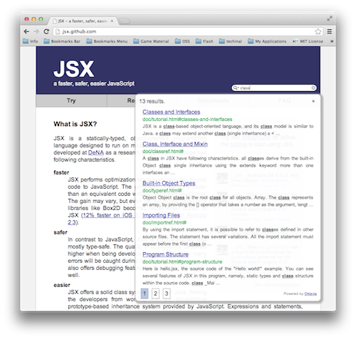

First website it uses Oktavia
=============================

Today, Oktavia is merged into `JSX <http://jsx.github.com/>`_ website that is hosted on Github pages. Let's try!

This is a first example of Oktavia search engine. JSX is a programming language to generate JavaScript. As its tagline, "faster safer easier", it provides type checking and optimization to JavaScript programmers. It is a return to the cool programming language, JSX, because Oktavia is written in JSX (and found bug, improved libraries).

.. more::

As this website, Oktavia can provide a full text search engine to static websites like Bitbucket pages, Github pages, Google drive and so on. This index file is provided as JavaScript source code (it contains a variable definition of base64 encoded binary file). Oktavia search engine reads the index file and creates Wavelet Matrix on memory, then provides search feature to user. All system works on browser. You don't have to mind a server set up, performance, cost etc.

Now I am writing installation guide to your website. Wait!

.. author:: default
.. categories:: sample
.. tags:: sample, web
.. comments::
