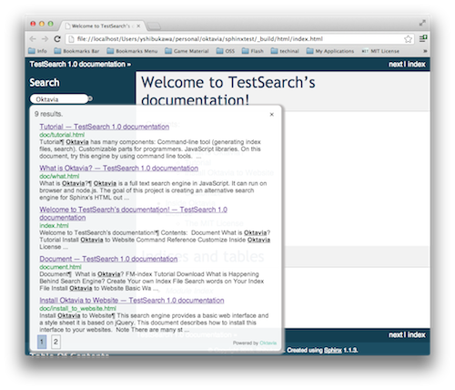

Add Supporting Sphinx/Tinkerer/JSDoc3
=====================================

Oktavia Web interface is appended. It can use as `jQuery <http://jquery.com/>`_ plug-in. You can use Oktavia to variety of websites flexibly.

.. more::

* :doc:`/pages/doc/install_to_website`

Do you use `Sphinx <http://sphinx-doc.org>`_ or `Tinkerer <http://tinkerer.me>`_, `JSDoc3 <https://github.com/jsdoc3/jsdoc>`_? Now special documents for these platforms are available.

* :doc:`/pages/doc/install_to_sphinx`
* :doc:`/pages/doc/install_to_tinkerer`
* :doc:`/pages/doc/install_to_jsdoc3`

And this website added a search form powered by Oktavia too!.

.. author:: default
.. categories:: development
.. tags:: update, status, web
.. comments::
