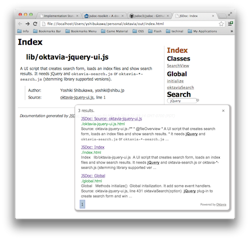

Install to JSDoc3
=================

This description is assuming you are using `JSDoc3 <github.com/jsdoc3/jsdoc>`_.
If you use `JSDoc Toolkit <https://code.google.com/p/jsdoc-toolkit/>`_, you should
modify template by yourself.

See the JSDoc3's template in `the github repository <https://github.com/shibukawa/oktavia/tree/master/templates/jsdoc3>`_. It is a complete set of template.

Install JSDoc3 like this (JSDoc3 doesn't support ``-g`` option now):

.. code-block:: bash

   $ git clone git@github.com:jsdoc3/jsdoc.git

Run JSDoc like this:

.. code-block:: bash

   $ node_modules/jsdoc/jsdoc -t templates/jsdoc3 [your javascript files]

Output files are genereted in ``./out`` folder. Following command creates an index:

.. code-block:: bash

   $ bin/oktavia-mkindex -i out -r out -f "#main" -c 5 -o scripts -m html -t js

