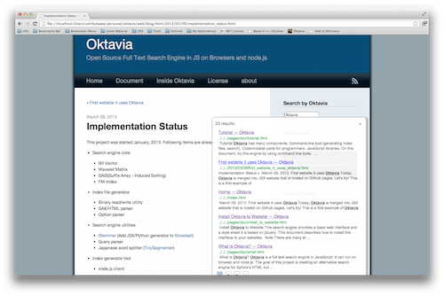

Install to Tinkerer
===================

`Tinkerer <http://www.tinkerer.me/>`_ is a blog system based on Sphinx. Using Oktavia with Tinkerer is easier than Sphinx because it uses more flexible sidebar template.
Sphinx itself provides a custom sidebar feature, but it erases all existing contents. It is not problem for Tinkerer because it uses this feature basically.

See the Tinkerer's template in `the github repository <https://github.com/shibukawa/oktavia/tree/master/templates/tinkerer>`_.

1. After creating a project folder (by using ``tinker``), copy needed files into a ``_static`` folder.

   * ``oktavia-search.js`` or ``oktavia-*-search.js``
   * ``oktavia-jquery-ui.js``
   * ``searchstyle.css``

2. Add ``oktaviasearch.html`` into a ``_templates`` folder.

3. Change the sidebar setting of ``conf.py``.

   You should add ``oktaviasearch.html`` and remove ``search.html``.

   .. code-block:: python

      html_sidebars = {
         "**": ["oktaviasearch.html", "install.html", "recent.html", "tags.html"]
      }

